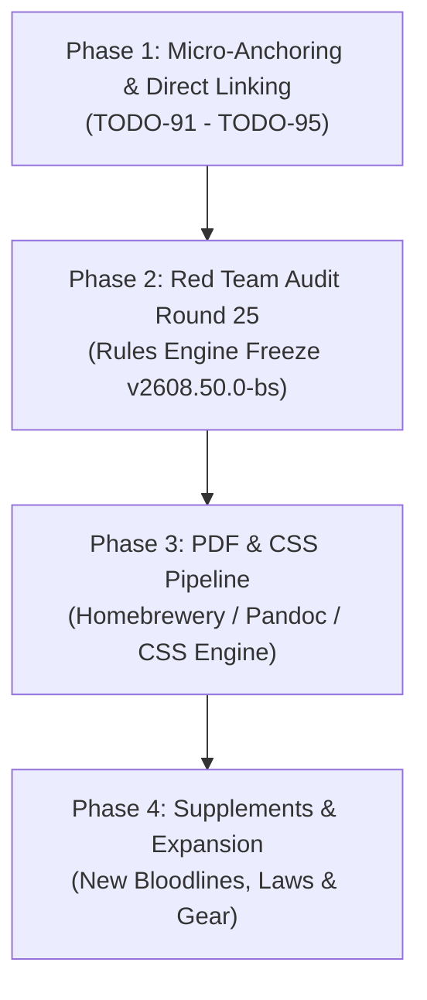

# Vampire TTRPG Framework — Generation 2608 Strategic Roadmap

This document outlines the official 4-Phase Strategic Roadmap for the Vampire Ruleset Generation 2608 framework. It provides the architectural path for stabilization, micro-anchoring, rules auditing, PDF rendering, and supplement expansion.

---

## 🗺️ Strategic Development Phases

---

### 📍 Phase 1: Micro-Anchors (`<a id="...">`) & Direct Line-Level Linking
**Status:** 🔄 *IN PROGRESS (Tasks TODO-91 through TODO-95)*

* **Objective:** Insert invisible HTML line-level micro-anchors (``) into every individual power, ritual, law protocol, and weapon across all framework files.
* **Key Benefits:**
  * Enables 100% precise line-level anchor jumps (`[Astral Step](vampire.md#astral-step)` or `[Corpse Siphon](vampire.md#corpse-siphon)`).
  * Preserves clean bullet point formatting (`* **Power Name:**`) without fragmenting markdown with 120+ oversized header tags (`#####`).
  * Prevents PDF Bookmark drawer explosion and column orphan layout bugs during PDF conversion.
* **Target Files & Tasks:**
  * [`TODO-91`](./todo.json): `vampire.md` — Powers (~60 entries across 12 `-mancy` disciplines)
  * [`TODO-92`](./todo.json): `supplements/bloodline_magic.md` — Rituals (~10 entries across 3 Arcana tiers)
  * [`TODO-93`](./todo.json): `supplements/coven_law_protocols.md` — Laws & Protocols (~20 entries)
  * [`TODO-94`](./todo.json): `supplements/uv_arsenal_handbook.md` — UV Weapons & Tech (~15 entries)
  * [`TODO-95`](./todo.json): Cross-reference synchronization across all files.

---

### 🛡️ Phase 2: Red Team Audit Round 25 (Rules Engine Stabilization & Freeze)
**Status:** 📅 *QUEUED (Post Phase 1)*

* **Objective:** Execute a comprehensive Red Team Audit targeting the newly refactored 12 `-mancy` discipline taxonomy, power classification tags (`[Behavioral]` vs `[Supernatural]`), and ritual interactions.
* **Key Focus Areas:**
  * Inter-power combat interactions (e.g. *Gravity Shield* vs *Hellfire Orb*, *Bio-Sonar* in silence dead-zones, *Resounding Beat* vs *Mind Tear*).
  * Age Tier math scaling ($\Delta$) consistency across all new Osteomancy and Astromancy powers.
  * Sire-progeny compel boundary integrity and Shatter trauma mechanics.
* **Milestone:** Lock and freeze core ruleset engine at **`v2608.50.0-bs`**.

---

### 🎨 Phase 3: PDF Publishing & Custom CSS Architecture Pipeline
**Status:** 📅 *QUEUED (Post Phase 2)*

* **Objective:** Establish the automated PDF build pipeline and custom CSS styling templates for professional 2-column TTRPG publishing.
* **Key Components:**
  * Establish layout templates and custom CSS classes (`.power-card`, `.stat-block`, `.ritual-box`, `vampire_theme.css`).
  * Integrate preprocessor compatibility for Homebrewery v3 / GMBinder / Pandoc / PrinceXML.
  * Build automated PDF generation scripts (`build_pdf.py`).
  * Verify 2-column page breaks, typography hierarchy, and interactive PDF clickable link resolving.

---

### 🚀 Phase 4: Content Expansion & Supplements
**Status:** 📅 *QUEUED (Post Phase 3)*

* **Objective:** Expand the Vampire TTRPG universe with new lore, bloodlines, rituals, and combat supplements built on top of a rock-solid, fully anchored, PDF-ready foundation.
* **Target Areas:**
  * **Old World & New World Bloodlines:** Unique bloodline latency arcana and heritage powers.
  * **Coven Tribunal Casebook:** Expanded legal precedents, trial scenarios, and exile dispensations.
  * **Advanced UV Technology & Thrall Warfare:** Special operations tactics, anti-vampire ordinance, and thrall combat equipment.

---

*Last Updated: 2026-08-05 | Ruleset Version: 2608.49.0-bs*
