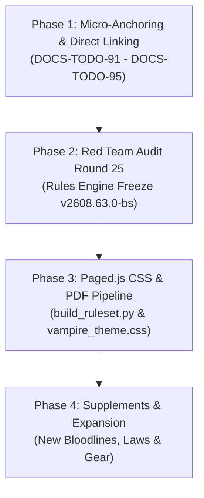

# Vampire TTRPG Framework — Generation 2608 Strategic Roadmap

This document outlines the official 4-Phase Strategic Roadmap for the Vampire Ruleset Generation 2608 framework. It provides the architectural path for stabilization, micro-anchoring, rules auditing, PDF rendering, and supplement expansion.

---

## 🗺️ Strategic Development Phases

---

### 📍 Phase 1: Micro-Anchors (`<a id="...">`) & Direct Line-Level Linking
**Status:** ✅ *COMPLETED (Tasks DOCS-TODO-91 through DOCS-TODO-95)*

* **Objective:** Insert invisible HTML line-level micro-anchors (``) into every individual power, ritual, law protocol, and weapon across all framework files.
* **Key Benefits:**
  * Enables 100% precise line-level anchor jumps (`[Astral Step](vampire.md#astral-step)` or `[Corpse Siphon](vampire.md#corpse-siphon)`).
  * Preserves clean bullet point formatting (`* **Power Name:**`) without fragmenting markdown with 120+ oversized header tags (`#####`).
  * Prevents PDF Bookmark drawer explosion and column orphan layout bugs during PDF conversion.
* **Target Files & Tasks:**
  * [`DOCS-TODO-91`](./2608/backlog.json): `vampire.md` — Powers (~60 entries across 12 `-mancy` disciplines)
  * [`DOCS-TODO-92`](./2608/backlog.json): `supplements/bloodline_magic.md` — Rituals (~10 entries across 3 Arcana tiers)
  * [`DOCS-TODO-93`](./2608/backlog.json): `supplements/coven_law_protocols.md` — Laws & Protocols (~20 entries)
  * [`DOCS-TODO-94`](./2608/backlog.json): `supplements/uv_arsenal_handbook.md` — UV Weapons & Tech (~15 entries)
  * [`DOCS-TODO-95`](./2608/backlog.json): Cross-reference synchronization across all files.

---

### 🛡️ Phase 2: Red Team Audit Round 25 (Rules Engine Stabilization & Freeze)
**Status:** ✅ *COMPLETED (Core ruleset stabilized and frozen at v2608.63.0-bs)*

* **Objective:** Execute a comprehensive Red Team Audit targeting the newly refactored 12 `-mancy` discipline taxonomy, power classification tags (`[Behavioral]` vs `[Supernatural]`), and ritual interactions.
* **Milestone:** Lock and freeze core ruleset engine at **`v2608.63.0-bs`**.

---

### 🎨 Phase 3: PDF Publishing & Paged.js Architecture Pipeline
**Status:** ✅ *COMPLETED (Pipeline established via .dev/2608/build_ruleset.py and Paged.js Level 3 CSS)*

* **Objective:** Establish the automated PDF build pipeline and custom CSS styling templates for professional 2-column TTRPG publishing.
* **Key Components:**
  * Established layout templates and custom CSS classes (`.power-card`, `.stat-block`, `.ritual-box`, `vampire_theme.css`).
  * Automated Paged.js rendering pipeline script (`.dev/2608/build_ruleset.py`).
  * Validated 2-column page breaks, mirrored verso/recto spreads, and typography normalization across all 4 books.

---

### 🚀 Phase 4: Content Expansion & Supplements
**Status:** 🔄 *IN PROGRESS*

* **Objective:** Expand the Vampire TTRPG universe with new lore, bloodlines, rituals, and combat supplements built on top of a rock-solid, fully anchored, PDF-ready foundation.
* **Target Areas:**
  * **Old World & New World Bloodlines:** Unique bloodline latency arcana and heritage powers.
  * **Coven Tribunal Casebook:** Expanded legal precedents, trial scenarios, and exile dispensations.
  * **Advanced UV Technology & Thrall Warfare:** Special operations tactics, anti-vampire ordinance, and thrall combat equipment.

---

*Last Updated: 2026-08-15 | Ruleset Version: 2608.66.0-bs*

